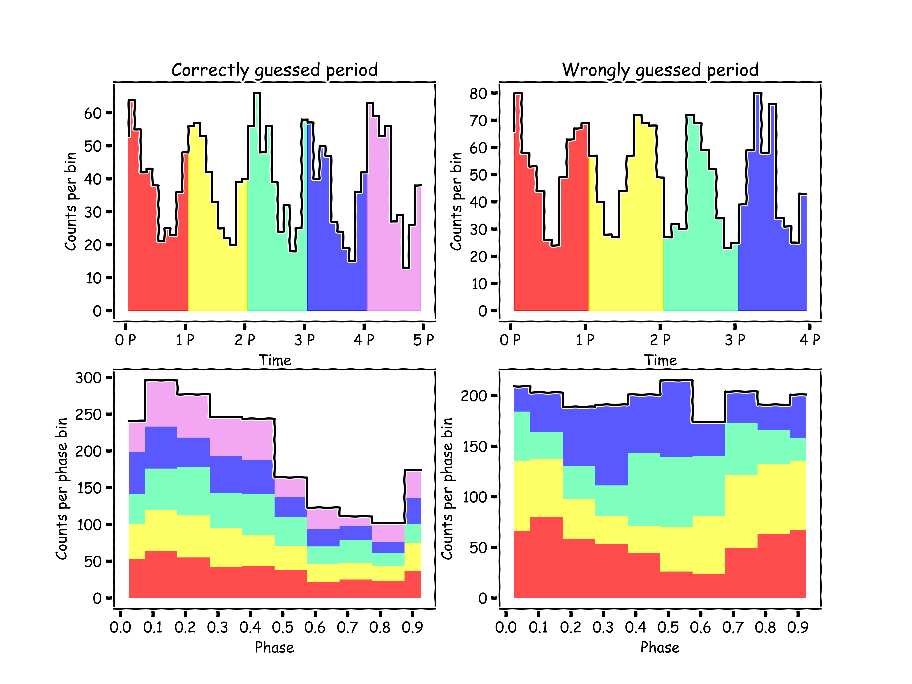
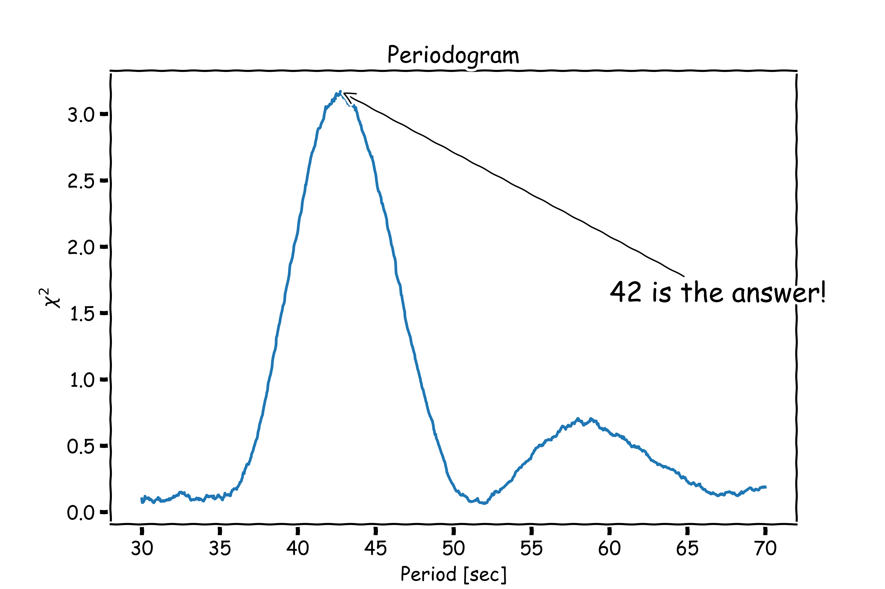

# Epoch Folding

♪ My period don't jiggle jiggle, it folds... ♪

[](https://semaphorep.github.io/codeastro/)
[](https://efsearch.readthedocs.io/en/latest/)

A python script to find the time period of a given time series data

## Algorithm 
Photon arrival times $t_k$ (total number of photons $N$) are divided into $n$ phase bins of assumed period $P$. If there is no periodicity in data we expect to see uniform distribution of events among the bins. But if there is a periodicity we will see pulse profile. 

To compare the $\chi^2$- statistics is calculated.

$\displaystyle \chi^2=\sum_{i=1}^n\cfrac{(O_i-E_i)^2}{E_i^2}$,

where $O_i$ is observed number of photons in $i$-th bin, $E_i=N/n$ is expected from uniform distribution number of photons.

If $\chi^2$ is big we expect to see periodicity in data.

Below you can see an example of folding with correct and wrong period.



## Installation

```bash
pip install git+https://github.com/maksatsat/efsearch.git
```

## Example

```python
from efsearch.ef_search import search, periodic_generator
```

Generating periodic data with period=30:

 ```python
times = periodic_generator(period= 42, obs_length = 1000, mean_countrate = 50, pulsed_fraction = 1.0)
```
Calculating chi2 statistics for periods from 10 to 50 seconds  and plotting the results:
 ```python
periods, chi2 = search(times, 30, 70)
with plt.xkcd():
    plt.plot(periods, chi2)
```
 

## References:

[Leahy et al. 1989 (On searches for pulsed emission with application to four globular cluster X-ray sources : NGC 1851, 6441, 6624 and 6712)](https://ui.adsabs.harvard.edu/abs/1983ApJ...266..160L/abstract)