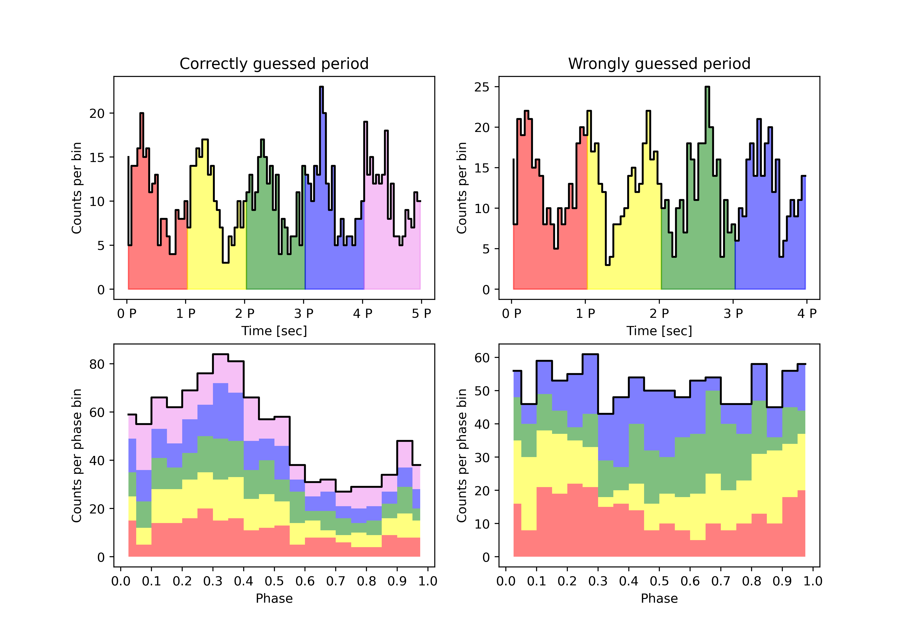

# Epoch Folding

A python script to find the time period of a given time series data

## Algorithm 
Photon arrival times $t_k$ (total number of photons $N$) are divided into $n$ phase bins of assumed period $P$. If there is no periodicity in data we expect to see uniform distribution of events among the bins. But if there is a periodicity we will see pulse profile. 

To compare the $\chi^2$- statistics is calculated.

$\displaystyle \chi^2=\sum_{i=1}^n\cfrac{(O_i-E_i)^2}{E_i^2}$,

where $O_i$ is observed number of photons in $i$-th bin, $E_i=N/n$ is expected from uniform distribution number of photons.

If $\chi^2$ is big we expect to see periodicity in data.

## References:

[Leahy et al. 1989 (On searches for pulsed emission with application to four globular cluster X-ray sources : NGC 1851, 6441, 6624 and 6712)](https://ui.adsabs.harvard.edu/abs/1983ApJ...266..160L/abstract)